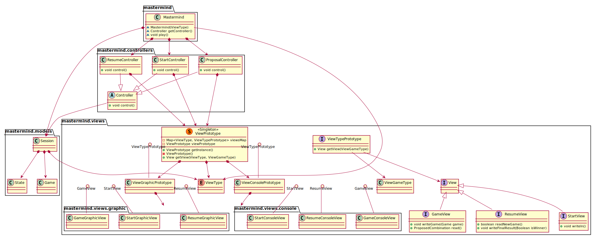

## 4954-PatArqSoft-Practica4
### Practica 4
* Fecha de entrega: 21/10/2019
* Integrantes:
  * Neo Koutsourais


## Diagrama MasterMind

<p align="center">
  
</p>

### PlantUML
 
 ```PlantUML
@startuml

package mastermind {
class Mastermind {
    ~Mastermind(ViewType)
    ~Controller getController()
    ~void play()
}
}

package mastermind.controllers {
abstract class Controller{ 
    +{abstract} void control()
} 

StartController -down-|> Controller 
ProposalController -down-|> Controller 
ResumeController -down-|> Controller

class StartController { 
    +void control() 
}

class ProposalController { 
    +void control() 
} 

class ResumeController { 
    +void control() 
}
}

Mastermind *-down-> StartController 
Mastermind *-down-> ProposalController 
Mastermind *-down-> ResumeController 

package mastermind.views {
class ViewPrototype << (S,#FF7700) Singleton >> {
 - Map<ViewType, ViewTypePrototype> viewsMap
 - {static} ViewPrototype viewPrototype
 + ViewPrototype getInstance()
 - ViewPrototype()
 + View getView(ViewType, ViewGameType)
}

ViewPrototype *-down-> ViewType

interface ViewTypePrototype {
    + View getView(ViewGameType)
}

interface View
interface StartView {
    + void writeln()
}
interface GameView {
    + void writeGame(Game game)
    + ProposedCombination read()
}
interface ResumeView {
    + boolean readNewGame()
    + void writeFinalResult(Boolean isWinner)
}

View <|-down- StartView
View <|-down- GameView
View <|-down- ResumeView

ViewTypePrototype ()-- ViewConsolePrototype
ViewTypePrototype ()-- ViewGraphicPrototype

ViewTypePrototype --> ViewGameType
ViewTypePrototype --> View

ViewPrototype *--> ViewConsolePrototype
ViewPrototype *--> ViewGraphicPrototype

enum ViewType

package mastermind.views.console {
class StartConsoleView
class GameConsoleView
class ResumeConsoleView
}

package mastermind.views.graphic {
class StartGraphicView
class GameGraphicView
class ResumeGraphicView
}

StartView ()-- StartConsoleView
GameView ()-- GameConsoleView
ResumeView ()-- ResumeConsoleView

StartView ()-- StartGraphicView
GameView ()-- GameGraphicView
ResumeView ()-- ResumeGraphicView

mastermind.views.console <-down-* ViewConsolePrototype
mastermind.views.graphic <-down-* ViewGraphicPrototype

}

StartController *-down-> ViewPrototype
ProposalController *-down-> ViewPrototype
ResumeController *-down-> ViewPrototype

package mastermind.models {
class Session
class State 
class Game

Session *-down-> State 
Session *-down-> Game 
}


Session *-down-> ViewType

Controller --> Session 
Mastermind *-down-> Session
Mastermind --> ViewType


@enduml
 ```