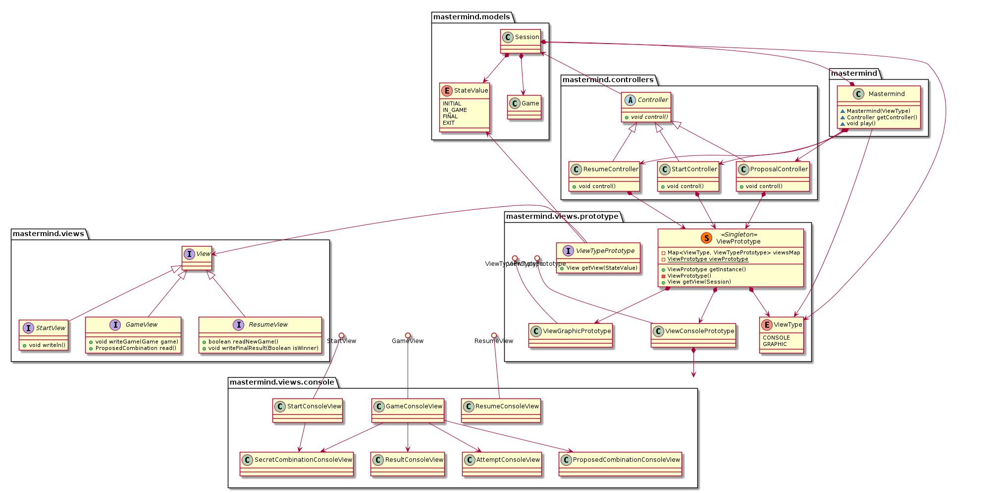

## 4954-PatArqSoft-Practica4
### Practica 4
* Fecha de entrega: 21/10/2019
* Integrantes:
  * Neo Koutsourais


## Diagrama MasterMind

<p align="center">
  
</p>

### PlantUML
 
 ```PlantUML
@startuml

package mastermind {
class Mastermind {
   ~Mastermind(ViewType)
   ~Controller getController()
   ~void play()
}
}

package mastermind.models {
class Session
enum StateValue {
 INITIAL 
 IN_GAME
 FINAL
 EXIT
}
class Game

Session *-down-> StateValue 
Session *-down-> Game 
}

package mastermind.controllers {
abstract class Controller{ 
   +{abstract} void control()
} 

StartController -up-|> Controller 
ProposalController -up-|> Controller 
ResumeController -up-|> Controller

class StartController { 
   +void control() 
}

class ProposalController { 
   +void control() 
} 

class ResumeController { 
   +void control() 
}
}

Mastermind *-down-> StartController 
Mastermind *-down-> ProposalController 
Mastermind *-down-> ResumeController 

package mastermind.views {

interface View
interface StartView {
   + void writeln()
}
interface GameView {
   + void writeGame(Game game)
   + ProposedCombination read()
}
interface ResumeView {
   + boolean readNewGame()
   + void writeFinalResult(Boolean isWinner)
}

View <|-down- StartView
View <|-down- GameView
View <|-down- ResumeView

}

package mastermind.views.prototype {
class ViewPrototype << (S,#FF7700) Singleton >> {
- Map<ViewType, ViewTypePrototype> viewsMap
- {static} ViewPrototype viewPrototype
+ ViewPrototype getInstance()
- ViewPrototype()
+ View getView(Session)
}

ViewPrototype *-down-> ViewType

interface ViewTypePrototype {
   + View getView(StateValue)
}

ViewTypePrototype ()-- ViewConsolePrototype
ViewTypePrototype ()-- ViewGraphicPrototype

ViewPrototype *--> ViewConsolePrototype
ViewPrototype *--> ViewGraphicPrototype

enum ViewType {
 CONSOLE
 GRAPHIC
}

}

package mastermind.views.console {
class StartConsoleView
class GameConsoleView
class ResumeConsoleView

SecretCombinationConsoleView <-down- StartConsoleView
SecretCombinationConsoleView <-down- GameConsoleView
AttemptConsoleView <-down- GameConsoleView
ProposedCombinationConsoleView <-down- GameConsoleView
ResultConsoleView <-down- GameConsoleView
}


StartView ()-- StartConsoleView
GameView ()-- GameConsoleView
ResumeView ()-- ResumeConsoleView

mastermind.views.console <-down-* ViewConsolePrototype

StartController *-down-> ViewPrototype
ProposalController *-down-> ViewPrototype
ResumeController *-down-> ViewPrototype


ViewTypePrototype --> StateValue
ViewTypePrototype -left-> View

Session *-down-> ViewType

Controller -up-> Session 
Mastermind *-up-> Session
Mastermind -up-> ViewType


@enduml
 ```
